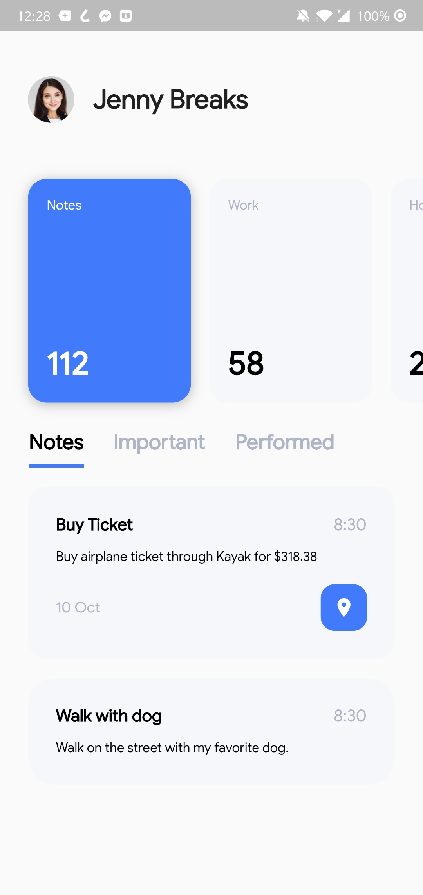
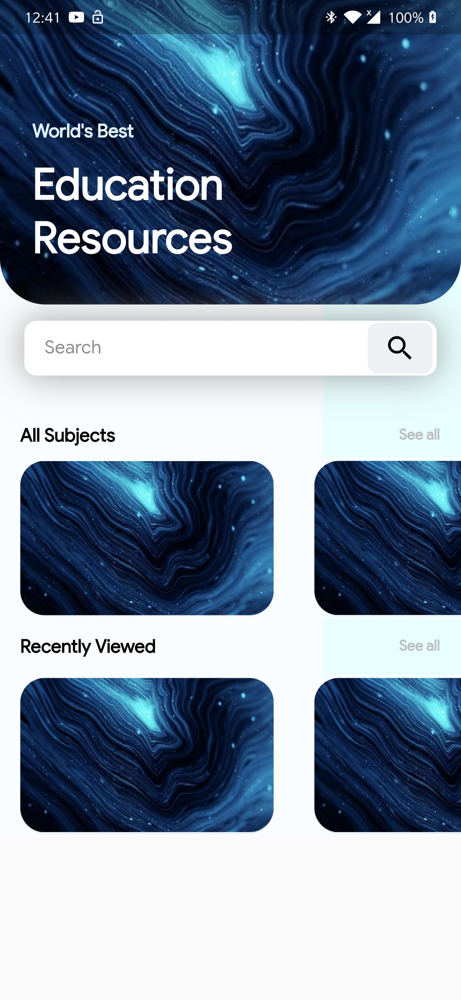
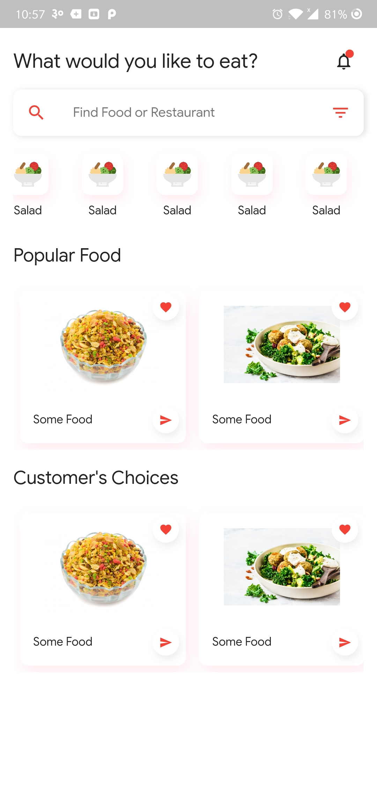
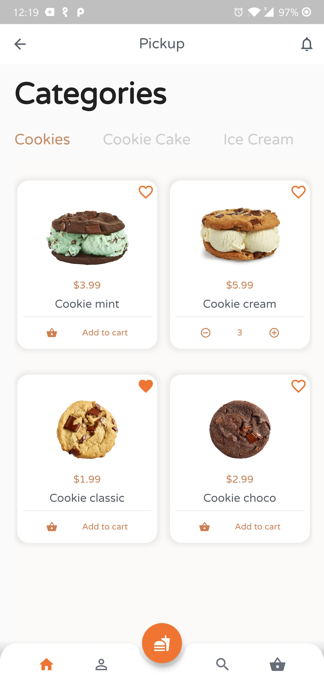
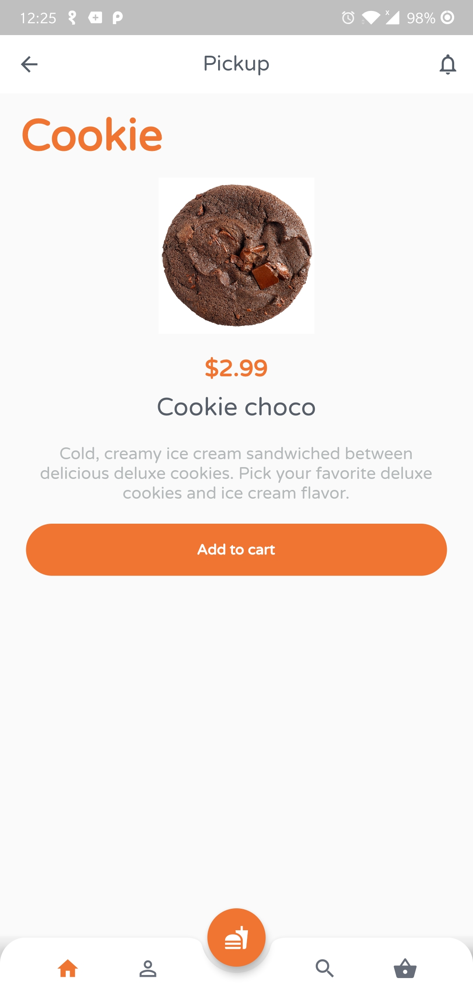

# flutter_ui_collections

Collection of UI Created in Flutter.

## UI Collection Names

1. Clothing Page
2. Notes Page
3. Education Page
4. Food Page
5. Cookie Page

| Page          | Snapshots                                           |                                                        |
| ------------- | --------------------------------------------------- | ------------------------------------------------------ |
| Clothing Page |    |                                                        |
| Notes Page    |       |                                                        |
| Edu Page      |  |       |
| Food Page     |        |                                                        |
| Cookie Page   |      |  |

> More will be added to the List.

Keep Coding. Cheers. 🎉 😎 🤘
